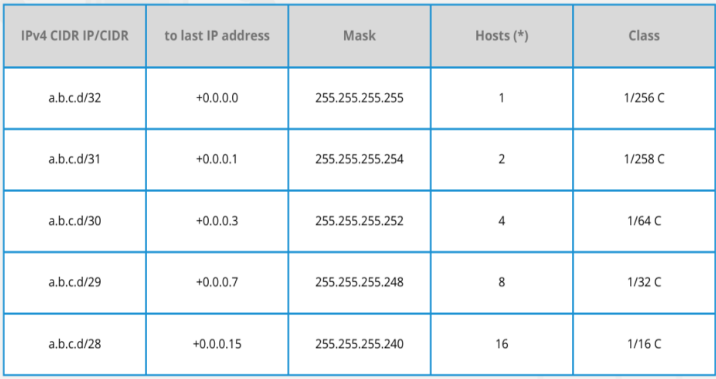
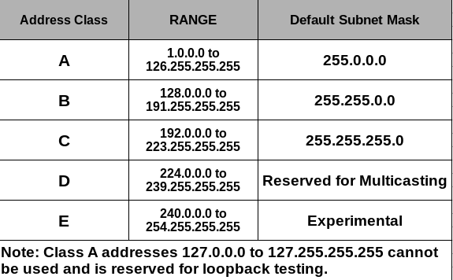

# INTRODUCTION TO IP ADDRESS
##

An IP address is a unique address that identifies a device on the internet or a local network. IP stands for "Internet Protocol," which is the set of rules governing the format of data sent via the internet or local network. In essence, IP addresses are the identifier that allows information to be sent between devices on a network: they contain location information and make devices accessible for communication. The internet needs a way to differentiate between different computers, routers, and websites. IP addresses provide a way of doing so and form an essential part of how the internet works.

What is an IP Address?
An IP address is a string of numbers separated by periods. IP addresses are expressed as a set of four numbers - an example address might be 192.158.1.38. Each number in the set can range from 0 to 255. So, the full IP addressing range goes from 0.0.0.0 to 255.255.255.255. IP addresses are not random. They are mathematically produced and allocated by the Internet Assigned Numbers Authority (IANA), a division of the Internet Corporation for Assigned Names and Numbers (ICANN). ICANN is a non- profit organization that was established in the United States in 1998 to help maintain the security of the internet and allow it to be usable by all. Each time anyone registers a domain on the internet, they go through a domain name registrar, who pays a small fee to ICANN to register the domain.

### Subneting and subnet masks

What is Subnetting? Subnetting is the practice of dividing a network into two or smaller networks. It increases routing efficiency, which helps to enhance the security of the network and reduces the size of the broadcast domain. IP Subnetting designates high-order bits from the host as part of the network prefix. This method divides a network into smaller subnets. It also helps you to reduce the size of the routing tables, which is stored in routers. This method also helps you to extend the existing IP address base & restructures the IP address

What is Subnet Mask? A subnet mask is a 32 bits address used to distinguish between a network address and a host address in IP identifies which part of an IP address is the network address and the host address. They are not shown traversing the Internet. They carry the destination IP address, which a router will match with a subnet. address. A subnet mask inside the data packets.

## CIDR NOTATION AND ADDRESS AGGREGATION
##

What is CIDR? Classless Inter-Domain Routing (CIDR) is an IP address allocation method that improves data routing efficiency on the internet. Every machine, server, and end-user device that connects to the internet has a unique number, called an IP address, associated with it. Devices find and communicate with one another by using these IP addresses. Organizations use CIDR to allocate IP addresses flexibly and efficiently in their networks.

IP Address Aggregator IP Address Aggregator is a utility developed to automate minimization process and convert bunch of IPv4 addresses into smallest continuous range(s) possible. IP aggregation is commonly performed by network engineers working with BGP & routers. This utility will help webmasters to configure server firewalls, apache.htaccess files, address masks and so on. Basic Usage IP Address Aggregation Tool accepts various IP address formats for input (scroll to Input Format Examples for more details). Enter IP Address list in a block of text (one IP Address or range per line) into IP Address Ranges input area. Select desired output format and click submit button. It will automatically discard any non-recognized or invalid address text. Once processed click on Copy To Clipboard button to directly copy results into memory and paste it anywhere else.

### IP Address Classes and Private IP Address Ranges
##

What is ##Classful Addressing##? Classful addressing is a network addressing the Internet's architecture from 1981 till Classless Inter-Domain Routing was introduced in 1993. This addressing method divides the IP address into five separate classes based on four address bits. Here, classes `A, B, C `offers addresses for networks of three distinct network sizes. Class `D` is only used for multicast, and class `E` reserved exclusively for experimental purposes.

#### Let's see each of the network classes in detail:

    - 
 